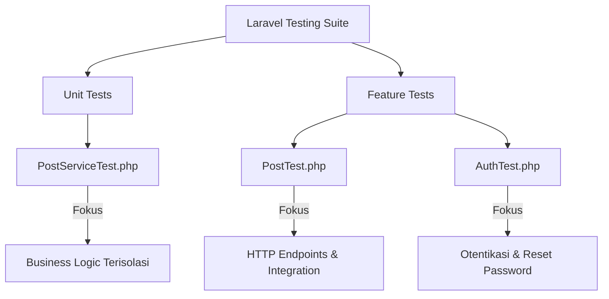

# Dokumentasi Pengujian Otomatis (Automated Testing)

Dokumen ini menjelaskan sistem pengujian otomatis yang diimplementasikan dalam proyek Laravel ini. Pengujian otomatis dirancang untuk memastikan bahwa setiap fitur, aturan bisnis (business logic), otorisasi, dan endpoint API berfungsi dengan benar dan tidak mengalami kerusakan (regression) saat ada perubahan kode di masa mendatang.

---

## 📋 Daftar Isi
1. [Arsitektur & Jenis Pengujian](#1-arsitektur--jenis-pengujian)
2. [Konfigurasi & Lingkungan Pengujian](#2-konfigurasi--lingkungan-pengujian)
3. [Detail Implementasi Test Case](#3-detail-implementasi-test-case)
    - [Unit Testing (`PostServiceTest`)](#a-unit-testing-postservicetest)
    - [Feature/API Testing (`PostTest` & `AuthTest`)](#b-featureapi-testing-posttest--authtest)
4. [Cara Menjalankan Pengujian](#4-cara-menjalankan-pengujian)
5. [Praktik Terbaik (Best Practices) yang Diterapkan](#5-praktik-terbaik-best-practices-yang-diterapkan)

---

## 1. Arsitektur & Jenis Pengujian

Proyek ini menerapkan dua jenis pengujian otomatis utama menggunakan **PHPUnit** bawaan Laravel:



### A. Unit Tests (Pengujian Unit)
* **Lokasi**: [tests/Unit](file:///c:/FILE%20CODE/REPO%20Integrative%20programming/Laravel_12/laravel_12_tester/tests/Unit)
* **Fokus**: Menguji logika bisnis terkecil secara terisolasi tanpa melalui lapisan HTTP/Routing. Di sini, kita langsung menguji service layer (`PostService`) untuk memastikan aturan kepemilikan (ownership) dan hak akses (authorization) di tingkat kode PHP berjalan semestinya.

### B. Feature Tests (Pengujian Fitur)
* **Lokasi**: [tests/Feature](file:///c:/FILE%20CODE/REPO%20Integrative%20programming/Laravel_12/laravel_12_tester/tests/Feature)
* **Fokus**: Menguji alur integrasi dari ujung ke ujung (end-to-end API lifecycle). Ini mensimulasikan permintaan HTTP (HTTP Requests) ke API Endpoint, memeriksa middleware otentikasi (Sanctum), validasi request payload, struktur respon JSON, dan efek sampingnya pada database.

---

## 2. Konfigurasi & Lingkungan Pengujian

Untuk memastikan pengujian berjalan dengan sangat cepat dan tidak memengaruhi database lokal pengembangan (development database), sistem pengujian dikonfigurasi sebagai berikut:

### 🖥️ Database SQLite in-Memory
Pengujian dijalankan menggunakan database **SQLite `:memory:`**. Hal ini membuat database dibuat langsung di RAM dan dihancurkan secara otomatis ketika proses pengujian selesai.
* Konfigurasi ini diatur dalam file `phpunit.xml` atau `.env.testing`.

### 🔄 Pembersihan Database Otomatis (`RefreshDatabase`)
Seluruh kelas pengujian mewarisi (extends) dari kelas dasar [TestCase.php](file:///c:/FILE%20CODE/REPO%20Integrative%20programming/Laravel_12/laravel_12_tester/tests/TestCase.php) yang menggunakan trait `RefreshDatabase`:
```php
namespace Tests;

use Illuminate\Foundation\Testing\RefreshDatabase;
use Illuminate\Foundation\Testing\TestCase as BaseTestCase;

abstract class TestCase extends BaseTestCase
{
    use RefreshDatabase;
}
```
Setiap kali satu unit atau fitur test dijalankan, Laravel akan menjalankan ulang migration secara otomatis. Hal ini menjamin status database selalu bersih di awal setiap metode pengujian, mencegah interdependensi data antar test case.

---

## 3. Detail Implementasi Test Case

Total terdapat **35 test methods** yang tersebar di 5 file pengujian dalam proyek ini. Berikut rincian lengkapnya:

### A. Unit Testing (Total: 7 Tests)

#### 1. [ExampleTest.php](file:///c:/FILE%20CODE/REPO%20Integrative%20programming/Laravel_12/laravel_12_tester/tests/Unit/ExampleTest.php) (1 Test)
* `that_true_is_true`: Pengujian dasar untuk memastikan PHPUnit berjalan dengan benar dengan melakukan assertion sederhana (`assertTrue(true)`).

#### 2. [PostServiceTest.php](file:///c:/FILE%20CODE/REPO%20Integrative%20programming/Laravel_12/laravel_12_tester/tests/Unit/PostServiceTest.php) (6 Tests)
Menguji business logic [PostService](file:///c:/FILE%20CODE/REPO%20Integrative%20programming/Laravel_12/laravel_12_tester/app/Services/PostService.php) secara terisolasi tanpa HTTP request:
* `admin_gets_all_posts`: Memastikan Admin dapat mengambil seluruh post dari semua user.
* `regular_user_gets_only_own_posts`: Memastikan user biasa hanya dapat mengambil post miliknya sendiri.
* `update_throws_403_for_non_owner`: Memastikan service melempar `HttpException` (HTTP 403) jika user yang bukan pemilik mencoba memperbarui postingan.
* `delete_throws_403_for_non_admin`: Memastikan service melempar `HttpException` (HTTP 403) jika user selain Admin mencoba menghapus postingan.
* `admin_can_delete_any_post`: Memastikan Admin dapat menghapus postingan milik siapapun dan data terhapus dari database.
* `create_post_assigns_correct_user_id`: Memastikan saat membuat post, user ID yang disimpan sesuai dengan user yang mengaktifkannya.

---

### B. Feature/API Testing (Total: 28 Tests)

#### 1. [ExampleTest.php](file:///c:/FILE%20CODE/REPO%20Integrative%20programming/Laravel_12/laravel_12_tester/tests/Feature/ExampleTest.php) (1 Test)
* `the_application_returns_a_successful_response`: Memastikan endpoint root `/` dapat diakses dengan sukses (HTTP 200).

#### 2. [PostTest.php](file:///c:/FILE%20CODE/REPO%20Integrative%20programming/Laravel_12/laravel_12_tester/tests/Feature/PostTest.php) (14 Tests)
Simulasi HTTP request/response API endpoint `/api/v1/posts`:
* **Skenario 401 - Unauthenticated**
  * `unauthenticated_user_cannot_list_posts`: Mencegah akses ke endpoint list post tanpa token (HTTP 401).
  * `unauthenticated_user_cannot_create_post`: Mencegah pembuatan post baru tanpa token (HTTP 401).
  * `unauthenticated_user_cannot_update_post`: Mencegah pembaruan post tanpa token (HTTP 401).
* **Skenario 201 - Create Post**
  * `authenticated_user_can_create_post`: User dengan token valid berhasil membuat post (HTTP 201) dan struktur JSON data lengkap.
* **Skenario 200 - List Posts**
  * `authenticated_user_can_list_own_posts`: User hanya menerima list post miliknya sendiri.
  * `admin_can_see_all_posts`: Admin menerima seluruh post dari semua user.
* **Skenario 200 - Show Post**
  * `user_can_view_own_post`: User dapat melihat detail data post milik sendiri.
* **Skenario 403 - Forbidden**
  * `user_cannot_update_post_of_another_user`: User biasa dilarang memperbarui post milik user lain.
  * `user_cannot_view_post_of_another_user`: User biasa dilarang melihat detail post milik user lain.
  * `regular_user_cannot_delete_any_post`: User biasa (bukan Admin) dilarang menghapus post apa pun (termasuk miliknya sendiri).
* **Skenario 404 - Not Found**
  * `returns_404_for_nonexistent_post`: Mengembalikan error jika mengambil detail post dengan ID yang tidak terdaftar.
  * `returns_404_when_updating_nonexistent_post`: Mengembalikan error jika memperbarui post dengan ID yang tidak terdaftar.
* **Skenario Admin Delete**
  * `admin_can_delete_any_post`: Admin berhasil menghapus post siapapun dan menerima response JSON `{deleted: true}`.
* **Skenario 422 - Validation**
  * `cannot_create_post_without_required_title`: Validasi error ketika request pembuat post tidak menyertakan field `title`.

#### 3. [AuthTest.php](file:///c:/FILE%20CODE/REPO%20Integrative%20programming/Laravel_12/laravel_12_tester/tests/Feature/AuthTest.php) (13 Tests)
Simulasi alur autentikasi dan reset password API di `/api/v1/...`:
* **Skenario Login (`POST /api/v1/login`)**
  * `login_succeeds_with_valid_credentials`: Login sukses menggunakan kredensial terdaftar dan mendapatkan token Sanctum.
  * `login_fails_with_wrong_password`: Gagal masuk dengan respon validasi error jika password tidak cocok (HTTP 422).
  * `login_fails_with_missing_fields`: Validasi error jika form login kosong (HTTP 422).
* **Skenario Register (`POST /api/v1/register`)**
  * `register_succeeds_for_public_as_regular_user`: Pendaftaran publik berhasil secara default sebagai role 'user'.
  * `register_by_admin_succeeds_with_custom_role`: Admin yang login dapat mendaftarkan akun baru dengan role kustom ('admin'/'user').
  * `register_fails_for_logged_in_non_admin`: Menolak user biasa yang sudah login untuk mendaftar kembali (HTTP 403).
  * `register_fails_with_invalid_input`: Validasi error jika input registrasi tidak sesuai atau email duplikat.
* **Skenario Logout (`POST /api/v1/logout`)**
  * `logout_succeeds_for_authenticated_user`: Revoke token aktif saat ini dengan sukses (HTTP 200).
  * `logout_fails_for_unauthenticated_user`: Menolak permintaan logout dari pengguna tidak sah (HTTP 401).
* **Skenario Reset Password (`POST /api/v1/reset-password`)**
  * `regular_user_can_reset_own_password_with_valid_old_password`: User mengganti password miliknya setelah memverifikasi password lama.
  * `regular_user_cannot_reset_own_password_with_invalid_old_password`: Gagal ganti password jika password lama tidak cocok (HTTP 422).
  * `admin_can_reset_password_of_any_user_without_old_password`: Admin dapat langsung mengubah password user lain berbekal email user target.
  * `reset_password_fails_with_unmatched_new_password_confirmation`: Validasi error jika password baru dan konfirmasi tidak sama.

---

## 4. Cara Menjalankan Pengujian

Anda dapat menjalankan seluruh rangkaian pengujian menggunakan perintah php artisan atau phpunit secara langsung di terminal Anda:

### 🏃‍♂️ Menggunakan Laravel Artisan (Direkomendasikan)
Perintah ini memberikan output yang sangat ramah pengguna (user-friendly) dengan warna dan durasi eksekusi per test case:
```bash
php artisan test
```

### 🎯 Menjalankan File Test Tertentu
Jika Anda hanya ingin menjalankan unit test saja atau file tertentu untuk mempercepat debugging:
```bash
# Menjalankan hanya Unit Tests
php artisan test --testsuite=Unit

# Menjalankan hanya Feature Tests
php artisan test --testsuite=Feature

# Menjalankan file test tertentu berdasarkan nama file
php artisan test tests/Unit/PostServiceTest.php
```

---

## 5. Praktik Terbaik (Best Practices) yang Diterapkan

Proyek ini telah mengikuti panduan dan standar industri terbaik dalam pengembangan aplikasi Laravel:

1. **Prinsip Isolasi**: Setiap unit tes tidak memanggil API HTTP. Sebaliknya, ia langsung menguji kelas PHP/Service untuk meminimalkan beban overhead dan mempercepat eksekusi.
2. **Penggunaan Model Factories**: Data uji dibuat secara dinamis menggunakan model factory (`User::factory()`, `Post::factory()`) dengan state khusus seperti `.admin()` dan `.asUser()`, menghindari penggunaan fixture statis yang sulit dirawat.
3. **Pernyataan Database (Database Assertions)**: Menggunakan `$this->assertDatabaseHas()` dan `$this->assertDatabaseMissing()` untuk membuktikan bahwa perubahan status benar-benar terjadi di tingkat persisten (database).
4. **Struktur Assertions JSON yang Ketat**: Menguji format keluaran API dengan `assertJsonStructure` dan `assertJsonPath` untuk menghindari kerusakan integrasi pada aplikasi frontend / client API.
5. **Atribut Pengujian PHP 8**: Menggunakan atribut PHP `#[Test]` daripada anotasi komentar `@test` demi kepatuhan terhadap standar PHP modern.
