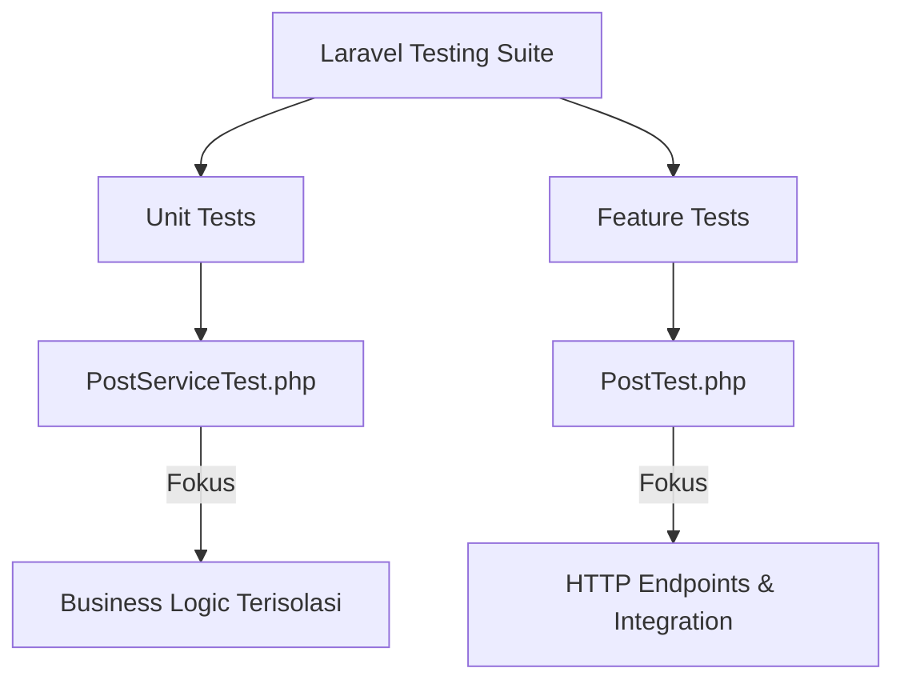

# Dokumentasi Pengujian Otomatis (Automated Testing)

Dokumen ini menjelaskan sistem pengujian otomatis yang diimplementasikan dalam proyek Laravel ini. Pengujian otomatis dirancang untuk memastikan bahwa setiap fitur, aturan bisnis (business logic), otorisasi, dan endpoint API berfungsi dengan benar dan tidak mengalami kerusakan (regression) saat ada perubahan kode di masa mendatang.

---

## 📋 Daftar Isi
1. [Arsitektur & Jenis Pengujian](#1-arsitektur--jenis-pengujian)
2. [Konfigurasi & Lingkungan Pengujian](#2-konfigurasi--lingkungan-pengujian)
3. [Detail Implementasi Test Case](#3-detail-implementasi-test-case)
    - [Unit Testing (`PostServiceTest`)](#a-unit-testing-postservicetest)
    - [Feature/API Testing (`PostTest`)](#b-featureapi-testing-posttest)
4. [Cara Menjalankan Pengujian](#4-cara-menjalankan-pengujian)
5. [Praktik Terbaik (Best Practices) yang Diterapkan](#5-praktik-terbaik-best-practices-yang-diterapkan)

---

## 1. Arsitektur & Jenis Pengujian

Proyek ini menerapkan dua jenis pengujian otomatis utama menggunakan **PHPUnit** bawaan Laravel:



### A. Unit Tests (Pengujian Unit)
* **Lokasi**: [tests/Unit](file:///c:/FILE%20CODE/REPO%20Integrative%20programming/Laravel_12/laravel_12_tester/tests/Unit)
* **Fokus**: Menguji logika bisnis terkecil secara terisolasi tanpa melalui lapisan HTTP/Routing. Di sini, kita langsung menguji service layer (`PostService`) untuk memastikan aturan kepemilikan (ownership) dan hak akses (authorization) di tingkat kode PHP berjalan semestinya.

### B. Feature Tests (Pengujian Fitur)
* **Lokasi**: [tests/Feature](file:///c:/FILE%20CODE/REPO%20Integrative%20programming/Laravel_12/laravel_12_tester/tests/Feature)
* **Fokus**: Menguji alur integrasi dari ujung ke ujung (end-to-end API lifecycle). Ini mensimulasikan permintaan HTTP (HTTP Requests) ke API Endpoint, memeriksa middleware otentikasi (Sanctum), validasi request payload, struktur respon JSON, dan efek sampingnya pada database.

---

## 2. Konfigurasi & Lingkungan Pengujian

Untuk memastikan pengujian berjalan dengan sangat cepat dan tidak memengaruhi database lokal pengembangan (development database), sistem pengujian dikonfigurasi sebagai berikut:

### 🖥️ Database SQLite in-Memory
Pengujian dijalankan menggunakan database **SQLite `:memory:`**. Hal ini membuat database dibuat langsung di RAM dan dihancurkan secara otomatis ketika proses pengujian selesai.
* Konfigurasi ini diatur dalam file `phpunit.xml` atau `.env.testing`.

### 🔄 Pembersihan Database Otomatis (`RefreshDatabase`)
Seluruh kelas pengujian mewarisi (extends) dari kelas dasar [TestCase.php](file:///c:/FILE%20CODE/REPO%20Integrative%20programming/Laravel_12/laravel_12_tester/tests/TestCase.php) yang menggunakan trait `RefreshDatabase`:
```php
namespace Tests;

use Illuminate\Foundation\Testing\RefreshDatabase;
use Illuminate\Foundation\Testing\TestCase as BaseTestCase;

abstract class TestCase extends BaseTestCase
{
    use RefreshDatabase;
}
```
Setiap kali satu unit atau fitur test dijalankan, Laravel akan menjalankan ulang migration secara otomatis. Hal ini menjamin status database selalu bersih di awal setiap metode pengujian, mencegah interdependensi data antar test case.

---

## 3. Detail Implementasi Test Case

### A. Unit Testing (`PostServiceTest`)
Kelas pengujian [PostServiceTest.php](file:///c:/FILE%20CODE/REPO%20Integrative%20programming/Laravel_12/laravel_12_tester/tests/Unit/PostServiceTest.php) berfokus pada pengujian unit terhadap layanan [PostService](file:///c:/FILE%20CODE/REPO%20Integrative%20programming/Laravel_12/laravel_12_tester/app/Services/PostService.php).

Metode pengujian yang diimplementasikan:
1. `admin_gets_all_posts`: Memastikan pengguna dengan peran Admin dapat memperoleh semua daftar post dari semua user lain.
2. `regular_user_gets_only_own_posts`: Memastikan user biasa hanya mendapatkan daftar post milik mereka sendiri.
3. `update_throws_403_for_non_owner`: Memastikan service melempar pengecualian HTTP 403 (HttpException) jika seseorang mencoba memperbarui post yang bukan miliknya.
4. `delete_throws_403_for_non_admin`: Memastikan service menolak aksi hapus dari user biasa dengan melemparkan HttpException 403.
5. `admin_can_delete_any_post`: Memastikan admin dapat menghapus postingan milik siapapun tanpa hambatan dan datanya hilang dari DB.
6. `create_post_assigns_correct_user_id`: Memastikan saat membuat post, user ID yang diasosiasikan benar-benar milik pengguna yang sedang aktif (authenticated).

---

### B. Feature/API Testing (`PostTest`)
Kelas pengujian [PostTest.php](file:///c:/FILE%20CODE/REPO%20Integrative%20programming/Laravel_12/laravel_12_tester/tests/Feature/PostTest.php) menyimulasikan panggilan API HTTP klien nyata terhadap endpoint `/api/v1/posts`.

Skenario pengujian yang tercakup:

| Kode Status | Skenario Pengujian | Deskripsi Kasus Uji |
| :---: | :--- | :--- |
| **401** | Unauthenticated | Memastikan request tanpa Token/Bearer Authentication ditolak saat mengakses endpoint list, create, dan update. |
| **201** | Store (Create) | User terotentikasi berhasil membuat postingan baru. Pengujian memeriksa struktur JSON kembalian dan memastikan entitas tersimpan di DB. |
| **200** | Index (List) | Memastikan data list post yang dikembalikan akurat sesuai hak akses (User hanya melihat miliknya, Admin melihat seluruhnya). |
| **200** | Show (Detail) | Memastikan user dapat melihat detail data post miliknya secara spesifik. |
| **403** | Forbidden | Memastikan User A dilarang mengedit atau melihat detail post milik User B. Juga memastikan User biasa dilarang menghapus post manapun. |
| **404** | Not Found | Menguji respon ketika melakukan request GET/PUT untuk ID post yang tidak terdaftar di database. |
| **200** | Admin Delete | Skenario khusus di mana Admin menghapus postingan milik pengguna lain dan memperoleh response sukses `{deleted: true}`. |
| **422** | Validation Error | Mengirim data kosong (tanpa `title`) untuk memastikan request ditolak dengan pesan error validasi spesifik. |

---

## 4. Cara Menjalankan Pengujian

Anda dapat menjalankan seluruh rangkaian pengujian menggunakan perintah php artisan atau phpunit secara langsung di terminal Anda:

### 🏃‍♂️ Menggunakan Laravel Artisan (Direkomendasikan)
Perintah ini memberikan output yang sangat ramah pengguna (user-friendly) dengan warna dan durasi eksekusi per test case:
```bash
php artisan test
```

### 🎯 Menjalankan File Test Tertentu
Jika Anda hanya ingin menjalankan unit test saja atau file tertentu untuk mempercepat debugging:
```bash
# Menjalankan hanya Unit Tests
php artisan test --testsuite=Unit

# Menjalankan hanya Feature Tests
php artisan test --testsuite=Feature

# Menjalankan file test tertentu berdasarkan nama file
php artisan test tests/Unit/PostServiceTest.php
```

---

## 5. Praktik Terbaik (Best Practices) yang Diterapkan

Proyek ini telah mengikuti panduan dan standar industri terbaik dalam pengembangan aplikasi Laravel:

1. **Prinsip Isolasi**: Setiap unit tes tidak memanggil API HTTP. Sebaliknya, ia langsung menguji kelas PHP/Service untuk meminimalkan beban overhead dan mempercepat eksekusi.
2. **Penggunaan Model Factories**: Data uji dibuat secara dinamis menggunakan model factory (`User::factory()`, `Post::factory()`) dengan state khusus seperti `.admin()` dan `.asUser()`, menghindari penggunaan fixture statis yang sulit dirawat.
3. **Pernyataan Database (Database Assertions)**: Menggunakan `$this->assertDatabaseHas()` dan `$this->assertDatabaseMissing()` untuk membuktikan bahwa perubahan status benar-benar terjadi di tingkat persisten (database).
4. **Struktur Assertions JSON yang Ketat**: Menguji format keluaran API dengan `assertJsonStructure` dan `assertJsonPath` untuk menghindari kerusakan integrasi pada aplikasi frontend / client API.
5. **Atribut Pengujian PHP 8**: Menggunakan atribut PHP `#[Test]` daripada anotasi komentar `@test` demi kepatuhan terhadap standar PHP modern.
